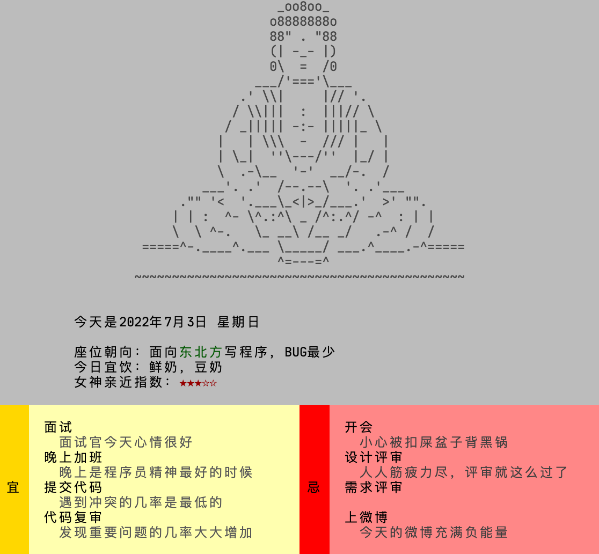

[](https://github.com/leizongmin/luckypg/actions/workflows/release.yml)

# luckypg (Lucky Programmer)

偶然间发现几年前写的一个有趣小工具 [命令行版程序员老黄历](https://github.com/leizongmin/programmer-calendar)，
如果将其设置成每次打开 Shell 的时候显示一下今天的运程来代替枯燥的命令提示符，也是一种不错的娱乐方式。
作为一种没有做"正事"的工具，之前使用 Node.js 实现的版本有点太重了，**luckypg** 是一个用 Go 重新实现的版本，
具有以下特点：

- 完全静态编译，不需要依赖任何动态库，放哪里都能跑；
- 可执行文件很小，在 macOS 上文件体积是 **16KB**，在 Linux 上文件体积是 **20KB**；
- 执行很快，约 ~10ms；

目前还存在的问题：

- 文案数据还比较少，需要继续丰富（原始文案数据非原创）；
- 显示界面是固定 80 字符宽度的，方块是左对齐，本来是计划自动显示在屏幕中间，
  为了追求更小的文件体积，使用 tinygo 编译时有些问题未解决，所以暂时放弃；



## 使用

在 macOS 和 Linux 上可以通过 **brew** 命令进行安装：

```bash
brew tap leizongmin/tools
brew install luckypg
```

或者通过 [Release](https://github.com/leizongmin/luckypg/releases) 页面下载，目前构建产物支持 macOS 和 Linux：

- 下载对应系统的构建产物，例如在 macOS 上对应的是 `luckypg-macos`，将其保存到为`/usr/local/bin/luckypg`；
- 然后将其添加到 `~/.profile` 文件，使得每次进入 Shell 的时候都会执行 `luckypg` 即可；
- 可根据自己当前的环境灵活配置。

FreeBSD 系统可以通过 **go** 命令自行构建：

```bash
# 安装 go
pkg install -y go
# 安装 luckypg
go install github.com/leizongmin/luckypg
# 构建产物位置
~/go/bin/luckypg
```

## 开发

在 Ubuntu/Debian 中初始化环境：

```bash
# 安装 go
wget https://go.dev/dl/go1.18.3.linux-amd64.tar.gz && \
  rm -rf /usr/local/go && tar -C /usr/local -xzf go1.18.3.linux-amd64.tar.gz
# 安装 tinygo
wget https://github.com/tinygo-org/tinygo/releases/download/v0.23.0/tinygo_0.23.0_amd64.deb
sudo dpkg -i tinygo_0.23.0_amd64.deb
# 安装 upx
apt install -y upx
```

在 macOS 中初始化环境：

```bash
# 安装 go、tinygo、upx
brew tap tinygo-org/tools
brew install golang tinygo upx
```

构建：

```bash
make
```

执行后构建产物为 `out/luckypg`。

## License

```
MIT License

Copyright (c) 2022 LEI Zongmin <leizongmin@gmail.com>

Permission is hereby granted, free of charge, to any person obtaining a copy
of this software and associated documentation files (the "Software"), to deal
in the Software without restriction, including without limitation the rights
to use, copy, modify, merge, publish, distribute, sublicense, and/or sell
copies of the Software, and to permit persons to whom the Software is
furnished to do so, subject to the following conditions:

The above copyright notice and this permission notice shall be included in all
copies or substantial portions of the Software.

THE SOFTWARE IS PROVIDED "AS IS", WITHOUT WARRANTY OF ANY KIND, EXPRESS OR
IMPLIED, INCLUDING BUT NOT LIMITED TO THE WARRANTIES OF MERCHANTABILITY,
FITNESS FOR A PARTICULAR PURPOSE AND NONINFRINGEMENT. IN NO EVENT SHALL THE
AUTHORS OR COPYRIGHT HOLDERS BE LIABLE FOR ANY CLAIM, DAMAGES OR OTHER
LIABILITY, WHETHER IN AN ACTION OF CONTRACT, TORT OR OTHERWISE, ARISING FROM,
OUT OF OR IN CONNECTION WITH THE SOFTWARE OR THE USE OR OTHER DEALINGS IN THE
SOFTWARE.
```
